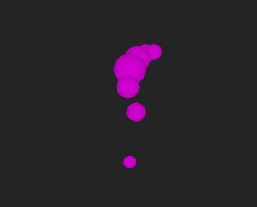

# COMP2160 Prac Week 13b - Procedural Animation

## LETs and LEUs
A reminder to please take a moment to complete the LETs and LEUs for this unit. This feedback is really important, and we need to reach a certain number of participants for us to see any of it. Please, if you have the time, fill them out.

## Today's Task
Today you will be implementing a basic forom of procedural animation, creating a snake-like creature entirely in code. This is a somewhat advanced practical which draws on understandings of Vectors, Encapsulation and Abstraction to create an animated creature. It is designed for those interested in the kinds of procedural animation you might find in games like Rain World. You can play a sample solution [here](https://uncanny-machines.itch.io/comp2160-prac-week-13b).

Note: This is one of two "bonus pracs" you can complete in Week 13. You can only recieve marks for one of them. If you have already completed 12 practials, you will not receive any marks for this prac.

## Step 1 - Basic bones (10 min)
We are going to start with a very basic set-up. In the project, you'll find a single object called "Creature", which has a child called "Head" with a script attached named "Creature" and another named "Bone".

Inside the Creature script, you'll find relatively familiar code for getting the creature to move towards the mouse position. Inside the Bone script, you'll find code for drawing it using Gizmos. Feel free to spend a little bit of time making sure you are familiar with the code, but don't tweak any paramaters just yet.


We are going to start building-out our creature by adding a bone - think of it as one vertebrae along a spine. 

We're going to start by creating a new empty game object, and giving it a meaningful name such as "Bone1". Place the `Bone` script on this object (NOT the `Creature` script!) and then change the size and/or colour so you can meaningfully differentiate between them. Make the Bone1 object a child of the Creature object (NOT the Head object!).

We now want to tell the Bone1 object to maintain a consistant distance from the Head object. By setting up this rule, we will appear to animate a serpent-like movement.

To start, create a new SerializeField in the Bone script, calling for another Bone with a meaningful name, like connected:

```
[SerializeField] private Bone connected;
```

Next, in the `Update()` method, we will add some code to have this Bone move to keep a consistant distance from its connected bone (in this case the Head). Because we are also using this Bone script on our Head, which has no connected Bone and instead follows the mouse, we will want to wrap this code in a null check:

```
if (connected != null)
{
    // Code goes here!
}
```

To achieve this connnection, draw upon your knowledge of Vectors from weeks 1, 2 and 3. We need our code to achieve the following:

* Create a speed variable to control how quickly the bones move into place (slower = stretchier).
* Find the vector between this bone and the connected bone.
* Check if the magnitude of that vector is larger than the connected bone's size (remember, this has a public getter!)
* Move this bone towards the connected bone if the magnitude of the vector is too large, using MoveTowards, Lerp, or whatever you fancy.

Now, set the "Connected" field on Bone1 to the Head object and hit play. You should be starting to see the beginnings of a little creature. Tweak the speed value a bit to get things feeling good.


## Step 2 - Adding parts (20 min)
Try adding more parts to your creature, hooking them up as you go, childing them all to the Creature object. Change sizes and starting positions to form a serpent like object. Remember, you want each Bone to have a connected Bone. Each Bone should move further away from the Head, and be connected to the one in front of it. (Bone2 is connected to Bone1, Bone3 is connected to Bone2, etc).

## Step 3 - Creating a shape (20 min)
Horray! We've now got a creature moving about but...it looks a bit boring. Try adjusting the size and speeds of each bone to create a more interesting shape. I created this one with six bones, and having higher speeds closer to the head with slower speeds to give a sort of stretchy tail effect:



## To receive half-marks for today, show your demonstator:
* Your creature with multiple parts, and the shape you formed it into.
* Your code for moving each bone.

## Step 4 - Refactoring (30 min)
At the moment, this code is a little bit messy. Having each bone specify its own connected bone very quickly becomes cumbersome. Generally, a rig will have all of this information stored in a single script.

Consider how you can refactor your code so that all Bone connections are handled in the Head class. Don't be afraid to stop and write down what your solution might look like. Here are some hints:

-You can have [SerializeField] Arrays.
-You could create a property for each Bone's connector.

If you get stuck, call over your demonstrator for some tips.

## Step 4 - Drawing the shape (40 min)
Let's finish off our creature. Instead of drawing it with Gizmos, add a Line Renderer component to the Head object. You can then set the positions and width of the Line programmatically, using data from each of the bones (position and size). Have a look through the [Line Renderer documentation](https://docs.unity3d.com/2022.3/Documentation/ScriptReference/LineRenderer.html) to find suitable methods to control this.

Hint: the line thickness is the hardest part of this. Remember that an AnimationCurve's keyframes take two values: time along the curve from 0.00-1.00, and a size value. This is meant as an advanced task, so don't be discouraged if you get a bit stuck. Call your demonstrator over once you've had a good crack at it.


## Prac Complete! To receive full marks, show your demonstrator:
* How you refactored your code to have a more sensible rig.
* How you made your line renderer react to the movement of your creature.

## Step 5 - More advanced forms (20 min)
This was a very basic introduction to procedural animation, with our worm-like creature really only having one "rule" (distance between bones). By introducing more rules and different joints/bones, you can create more interesting creatures. If you have some time left, make some notes or try out some different approaches to create something new!